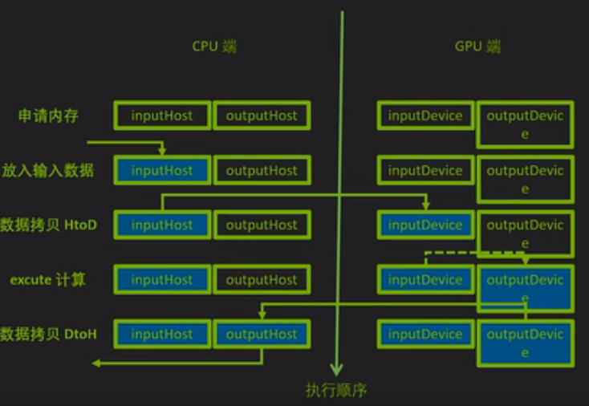

# CUDA_Learnning

## Tensort简介  
### 构建期(推理优化器)
| 功能 | 介绍 |
| ---  | ---  |
| 模型解析/建立  | 加载onnx等格式的模型 |
| 计算图优化  | 横向层融合，纵向层融合 |
| 节点消除  | 去除无效层，节点变换 |
| 多精度支持  | FP32/FP16/INT8/TF32 |
| 优选kernel/format  | 硬件优化相关 |
| 导入plugin  | 实现自定义操作 |
| 显存优化  | 显存池复用 |
           
### 运行期(运行时环境)
| 功能 | 介绍 |  
| ---  | ---  |  
| 运行时环境  | 对象生命期管理，内存显存管理，异常处理  |  
| 序列化，反序列化  | 推理引擎保存为文件，或从文件中加载  |  

### tensorrt加速指标
| optimization | CLIP | UNET*50 | VAE  | pipeLine |  

### tensorrt编码基本流程
1. 构建期  
   - 建立Logger(日志)
   - 建立Builder(网络元数据)和BuilderConfig(网络元数据的选项)
   - 创建Network网络 
   - 生成SerializedNetwork序列化网络
2. 运行期  
   - 建立engine和content  
   - Buffer相关准备(申请和拷贝)  
   - 执行推理  
   - 善后工作(资源释放)

### CUDA异构计算流程
    - 同时准备CPU端内存和GPU端内存
    - 开始计算时把数据从内存拷贝到显存
    - 计算过程中的输入输出均在GPU端读写
    - 计算完成后把结果拷贝到内存才能使用
   
### 预处理
   转换到的目标格式

### 后处理
   根据NMS(非极大值抑制)，进一步处理检测结果  

### 返回检测结果
   输出检测结果，如置信度，检测框坐标，时间戳，类别标签等。
